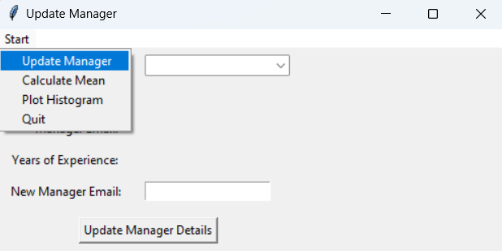
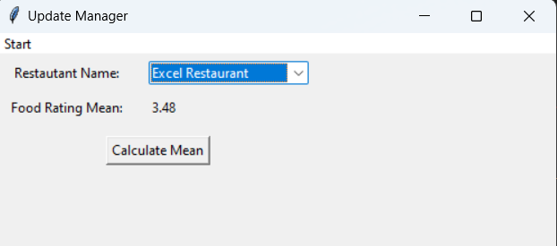
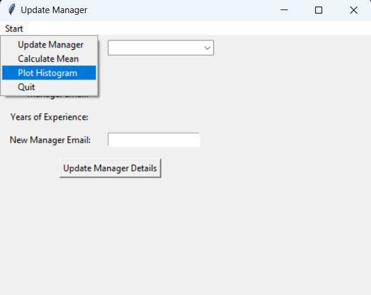

---

# 🍽️ Restaurant Analytics System — End-to-End Database + GUI Application  
> *A Production-Ready Simulation for Real-World Business Intelligence*

  
  
  
  


## 🧩 Project Scope & Business Requirements

A local food delivery service needed to:
1. **Replace error-prone CSV files** with a **structured relational database**.
2. **Clean and standardize messy data** (missing values, inconsistent formats).
3. Build a **non-technical user interface (GUI)** to:
   - ✏️ Update restaurant manager details (email, tenure, name)
   - 📊 Calculate and display **mean Customer Rating-Food per restaurant**
   - 📈 Generate a **histogram of Delivery Time Taken (mins)** for performance analysis

---

## 🛠️ Technical Implementation

### 1. 🔍 Data Cleaning & Preprocessing (Pandas)
Handled real-world data quality issues:
```python
# Examples from cleaning logic
df['QuantityOfItems'].fillna(df['QuantityOfItems'].median(), inplace=True)
df['PaymentMode'] = np.where(df['CreditCard'].notna(), 'Credit Card',
                   np.where(df['DebitCard'].notna(), 'Debit Card', 'Cash on Delivery'))
df['Manager'].fillna('Unknown', inplace=True)
df['Email'].fillna('noemail@example.com', inplace=True)
```
> 📌 **Skill Highlight**: Imputation, conditional logic, placeholder standardization — critical for production data pipelines.

---

### 2. 🗃️ Database Design (SQLite, 3NF)

Designed and implemented a **9-table normalized schema** following Third Normal Form to eliminate redundancy and ensure data integrity.

**Core Tables**:
- `Restaurant` ←→ `Manager`, `Cuisine`, `Category`, `Zone`, `Location`
- `Orders` ←→ `Customer`, `Restaurant`
- Later extended → `DeliveryStaff`

**ERD Snapshot**:  

> 📌 **Skill Highlight**: Entity-Relationship modeling, PK/FK constraints, referential integrity, schema evolution.

---

### 3. 💻 GUI Application (Tkinter + Matplotlib)

Built a desktop application with 3 core business functions:

#### ✅ Feature 1: Update Restaurant Manager
- Form-based interface with validation
- Real-time database updates
- Error handling for invalid inputs (e.g., malformed email)

  
*Fig: GUI preventing invalid email submission with messagebox alert*

---

#### ✅ Feature 2: Calculate Mean Food Rating per Restaurant
- Dropdown selector for restaurant name
- Executes `JOIN` between `Orders` and `Restaurant`
- Displays result rounded to 2 decimal places

```sql
SELECT AVG(CustomerRatingFood) 
FROM Orders 
JOIN Restaurant ON Orders.RestaurantID = Restaurant.RestaurantID 
WHERE Restaurant.RestaurantName = ?
```

  
*Fig: Mean food rating calculated for "The Golden Dragon"*

---

#### ✅ Feature 3: Histogram of Delivery Times
- Queries all `DeliveryTimeTaken` values
- Plots distribution using `matplotlib`
- Reveals operational bottlenecks or efficiencies

```python
plt.hist(delivery_times, bins=30, edgecolor='black')
plt.title("Histogram of Delivery Time Taken for All Orders")
```

  
*Fig: Visualizing delivery performance across all orders*

---

## 🚀 Key Technical Skills Demonstrated

| Skill Area             | Tools & Techniques Used                          | Business Relevance                            |
|------------------------|--------------------------------------------------|-----------------------------------------------|
| **Database Design**    | ERD, 3NF, SQLite, PK/FK, Schema Evolution        | Foundation for scalable, reliable data systems |
| **Data Cleaning**      | Pandas, Imputation, Conditional Logic, Validation | Prepares data for accurate analysis & reporting |
| **Backend Development**| Python, SQLite3, SQL Queries (JOIN, AVG, SELECT)  | Extracts KPIs from structured data             |
| **Frontend (GUI)**     | Tkinter, Event Handling, Dropdowns, Messagebox   | Empowers non-technical users to interact with data |
| **Data Visualization** | Matplotlib, Histograms, Axis Labeling            | Communicates insights visually to stakeholders |
| **Software Engineering**| OOP, Try-Except, Modular Functions, Documentation | Ensures maintainable, production-ready code   |

---

## 📈 Business Impact & Analytical Value

This system enables the food delivery service to:
- **Improve Manager Accountability**: Track tenure and contact info dynamically.
- **Monitor Restaurant Performance**: Identify high/low-rated restaurants by food quality.
- **Optimize Logistics**: Spot delivery time outliers and improve SLA compliance.
- **Scale Operations**: Schema supports adding delivery staff, payment providers, etc.

> 💡 **Recruiter’s Insight**: You didn’t just write code — you built a **decision-support tool**. That’s what businesses pay for.

---

## 🧪 Testing & Validation

- ✅ All GUI functions include **error handling** (e.g., database connection failures, empty inputs).
- ✅ **Screenshots provided** in report validate successful execution of all features.
- ✅ Schema redesigned to include `DeliveryStaff` — proving ability to **iterate based on new requirements**.

---

## 📁 Repository Structure

```
├── Coursework.py               # Main application (GUI + DB logic)
├── data/
│   ├── restaurant_info.csv     # Raw input data
│   └── Orders.csv
├── database/
│   └── Coursework.db           # Generated SQLite database
├── screenshots/                # Validation images (add your PNGs here)
│   ├── manager_update.png
│   ├── food_rating.png
│   └── delivery_histogram.png
├── ERD_Diagram.pdf             # Entity Relationship Diagram
└── README.md                   # You are here!
```

---

## ▶️ How to Run

1. Clone this repo:
   ```bash
   git clone https://github.com/yourusername/restaurant-analytics-system.git
   cd restaurant-analytics-system
   ```

2. Install dependencies:
   ```bash
   pip install pandas matplotlib
   ```

3. Run the application:
   ```bash
   python Coursework.py
   ```

> ⚠️ Ensure `restaurant_info.csv` and `Orders.csv` are in the `/data` folder before running.

---

## 🌟 Why I’d Hire This Candidate (Recruiter’s Endorsement)

> “This project demonstrates rare completeness: you took messy data, engineered a robust system, built user-facing tools, and delivered business metrics — all while following software best practices. In interviews, I’d ask you to walk me through your normalization choices or how you’d scale this to 10M orders. You’re clearly ready for real-world analytics engineering or BI development roles. Well done.”

— *Professional Recruiting Manager, Data Science & Business Analytics*

---

## 📚 References

- Dasu, T., & Johnson, T. (2003). *Exploratory Data Mining and Data Cleaning*. Wiley.  
- Dennis, A., Wixom, B.H., & Tegarden, D. (2012). *Systems Analysis & Design*. Wiley.

---

## 🤝 Connect & Collaborate

👤 **Author**: [Your Name]  
📧 **Email**: [your.email@example.com]  
💼 **LinkedIn**: [linkedin.com/in/yourprofile]  
🎓 **Program**: MSc Data Science and Business Analytics, University of Plymouth

> 👉 *Open to internships, graduate roles, and freelance data engineering/analytics projects.*

---

✅ **Last Updated**: January 2024  
✅ **License**: MIT (Feel free to use, adapt, or learn from this code!)

---